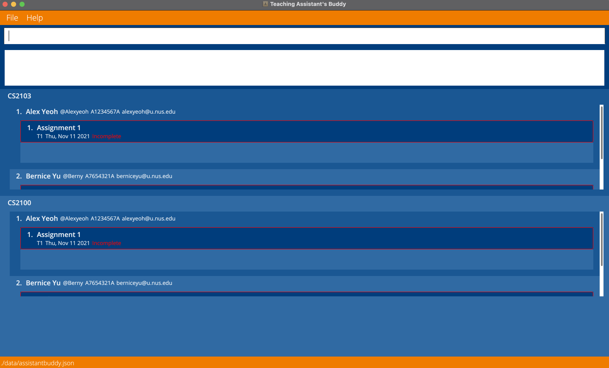

Teaching Assistant’s Buddy (TAB) is a **desktop app for managing tutees, optimized for use via a Command Line Interface** (CLI) while still 
having the benefits of a Graphical User Interface (GUI). If you can type fast, TAB can get your tutee management 
tasks done faster than traditional GUI apps.

* Table of Contents
{:toc}

--------------------------------------------------------------------------------------------------------------------

## Quick start

1. Ensure you have Java `11` or above installed in your Computer.

1. Download the latest `addressbook.jar` from [here](https://github.com/se-edu/TAB/releases).

1. Copy the file to the folder you want to use as the _home folder_ for TAB.

1. Double-click the file to start the app. The GUI similar to the below should appear in a few seconds. Note how the app contains some sample data. 
   

1. Type the command in the command box and press Enter to execute it. e.g. typing **`add module CS2103`** and pressing Enter will add the module CS2103 to TAB. 
   Some example commands you can try:

   * **`module add CS2103`** : Adds the module CS2103 to TAB

   * **`student add A0123456A, John Doe, @johndoe, john.doe@u.nus.edu`** : Adds student John Doe to TAB

1. Refer to the [Features](#features) below for details of each command.

--------------------------------------------------------------------------------------------------------------------

## Features

**:information_source: Notes about the command format:** 

* Words in `<angle brackets>` are the parameters to be supplied by the user. 
  e.g. in `module add <module name>`, `<module name>` is a parameter which can be used as `add module CS2103`.

* Parameters must be in the specified order. 
  e.g. if the command specifies `module add <module name>, <task name>`, `module add <task name>, <module name>` will not work

* Commas are used to separate parameters supplied by the user.

* In the current version, refrain from using commas within the parameters itself.

### Module add task: `add task`

Create a new task for a specific module

Format: `module add <module name>, <task name>`

Examples:
* `module add CS2103, assignment1`: Adds the task assignment1 to module CS2103
* `module add CS2100, lab1`: Adds the task lab1 to module CS2100

### Creating a new module: `module add`

Adds a new module to TAB

Format: `module add <module name>`

Examples:
* `module add CS2103`: Adds module CS2103 to TAB
* `module add CS2100`: Adds module CS2100 to TAB

### Creating a new task for a specific module: `module add task`

Adds a new task to the specified module

Format: `module add <module name>, <task name>`

Examples:
* `module add CS2103, assignment1`: Adds the task assignment1 to module CS2103
* `module add CS2100, lab1`: Adds the task lab1 to module CS2100

### Add student to a specific module: `module add student`

Add a new student to the specified module
Also automatically copies over the task list from the module to the student

Format: `module add <module name>, <student name>`

Examples:
* `module add CS2103, A1234567A`: Adds student with id A1234567A to module CS2103
* `module add CS2100, A7654321A`: Adds student with id A7654321A to module CS2100

### Delete student from a specific module: `module delete student`

Deletes the specified student from the specified module

Format: `module delete <module name>, <student id>`

Examples:
* `module delete CS2103, A1234567A`: Removes student with id A1234567A from module CS2103’s list of students
* `module delete CS2100, A7654321A`: Removes student with id A7654321A from module CS2100’s list of students

### Delete module from TAB: `module delete`

Deletes the specified module from TAB

Format: `module delete <module name>`

Examples:
* `module delete CS2103`: Deletes module CS2103 from TAB
* `module delete CS2100`: Deletes module CS2100 from TAB

### Create a new student: `student add`

Create a new student

Format: `student add <student id>, <student name>, <student teleHandle>, <student email>`

Examples:
* `student add A0123456A, John Doe, @johndoe, john.doe@u.nus.edu`: add student John Doe

### Get student information: `student get`

Get the student’s information (name, id, telehandle, email)

Format: `student get <student id>`

Examples:
* `student get A0123456A`: get information of the student with student id A0123456A

## FAQ

**Q**: How do I assign tasks to students 
**A**: Adding the student to the module will automatically add the tasks in the module to the student

--------------------------------------------------------------------------------------------------------------------

## Command summary

Action | Format, Examples
--------|------------------
**Add** | `module add <module name>`   e.g., `module add CS2103`
**Delete** | `module delete <module name>`  e.g., `module delete CS2103`
